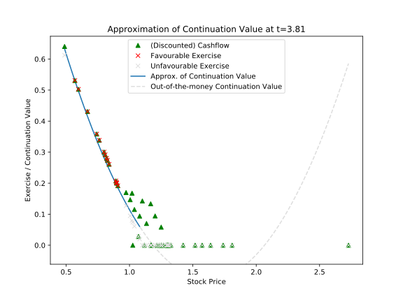

============================
Longstaff-Schwartz Algorithm
============================

.. image:: https://img.shields.io/pypi/v/longstaff_schwartz.svg
        :target: https://pypi.python.org/pypi/longstaff_schwartz

.. image:: https://img.shields.io/travis/luphord/longstaff_schwartz.svg
        :target: https://travis-ci.org/luphord/longstaff_schwartz

.. image:: https://readthedocs.org/projects/longstaff-schwartz/badge/?version=latest
        :target: https://longstaff-schwartz.readthedocs.io/en/latest/?badge=latest
        :alt: Documentation Status

A Python implementation of the Longstaff-Schwartz linear regression algorithm for the evaluation of call rights and American options.

* Seminal paper: **Francis A. Longstaff, Eduardo S. Schwartz**, *Valuing American Options by Simulation: A Simple Least-Squares Approach* (The Review of Financial Studies) (2001) Vol 14, No 1, pp. 113-147
* Documentation: https://longstaff-schwartz.readthedocs.io
* Free software: MIT license

Talks
-----

* PyConDE 2019-10-10: `Slides <https://raw.githack.com/luphord/longstaff_schwartz/master/talks/talk_pyconde_2019-10-10/index.html>`__, `Jupyter Notebook <https://github.com/luphord/longstaff_schwartz/blob/master/talks/talk_pyconde_2019-10-10/Notebook_PyConDE_2019-10-10.ipynb>`__
* PyData Meetup 2019-09-18: Slides_, `Jupyter Notebook`_

.. _Slides: https://raw.githack.com/luphord/longstaff_schwartz/master/talks/talk_meetup_2019-09-18/index.html
.. _`Jupyter Notebook`: https://github.com/luphord/longstaff_schwartz/blob/master/talks/talk_meetup_2019-09-18/Notebook_Meetup_2019-09-18.ipynb

Usage
-----

.. code-block:: python

        from longstaff_schwartz.algorithm import longstaff_schwartz
        from longstaff_schwartz.stochastic_process import GeometricBrownianMotion
        import numpy as np

        # Model parameters
        t = np.linspace(0, 5, 100)  # timegrid for simulation
        r = 0.01  # riskless rate
        sigma = 0.15  # annual volatility of underlying
        n = 50  # number of simulated paths

        # Simulate the underlying
        gbm = GeometricBrownianMotion(mu=r, sigma=sigma)
        rnd = np.random.RandomState(1234)
        x = gbm.simulate(t, n, rnd)  # x.shape == (t.size, n)

        # Payoff (exercise) function
        strike = 0.95

        def put_payoff(spot):
                return np.maximum(strike - spot, 0.0)

        # Discount factor function
        def constant_rate_df(t_from, t_to):
                return np.exp(-r * (t_to - t_from))

        # Approximation of continuation value
        def fit_quadratic(x, y):
                return np.polynomial.Polynomial.fit(x, y, 2, rcond=None)

        # Selection of paths to consider for exercise
        # (and continuation value approxmation)
        def itm(payoff, spot):
                return payoff > 0

        # Run valuation of American put option
        npv_american = longstaff_schwartz(x, t, constant_rate_df,
                                                fit_quadratic, put_payoff, itm)

        # European put option for comparison
        npv_european = constant_rate_df(t[0], t[-1]) * put_payoff(x[-1]).mean()

        # Check results
        assert np.round(npv_american, 4) == 0.0702
        assert np.round(npv_european, 4) == 0.0598
        assert npv_american > npv_european

Plots
-----

For details see `PyData Meetup Jupyter Notebook`_.

.. _`PyData Meetup Jupyter Notebook`: https://github.com/luphord/longstaff_schwartz/blob/master/talks/talk_meetup_2019-09-18/Notebook_Meetup_2019-09-18.ipynb

Approximation of continuation value
~~~~~~~~~~~~~~~~~~~~~~~~~~~~~~~~~~~

Favourable exercise
~~~~~~~~~~~~~~~~~~~

.. image:: docs/_static/exercise-or-hold.svg
.. image:: docs/_static/first-exercises.svg

Credits
-------

Main developer is luphord_.

.. _luphord: https://github.com/luphord

Primary source for the algorithm is **Francis A. Longstaff, Eduardo S. Schwartz**, *Valuing American Options by Simulation: A Simple Least-Squares Approach* (The Review of Financial Studies) (2001) Vol 14, No 1, pp. 113-147.
There is no affiliation between the authors of the paper and this code.

This package was prepared with Cookiecutter_ and the `audreyr/cookiecutter-pypackage`_ project template.

.. _Cookiecutter: https://github.com/audreyr/cookiecutter
.. _`audreyr/cookiecutter-pypackage`: https://github.com/audreyr/cookiecutter-pypackage
